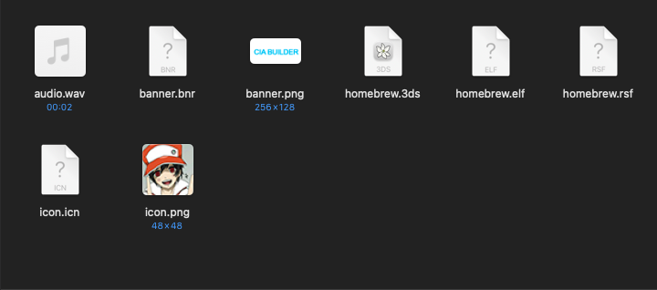
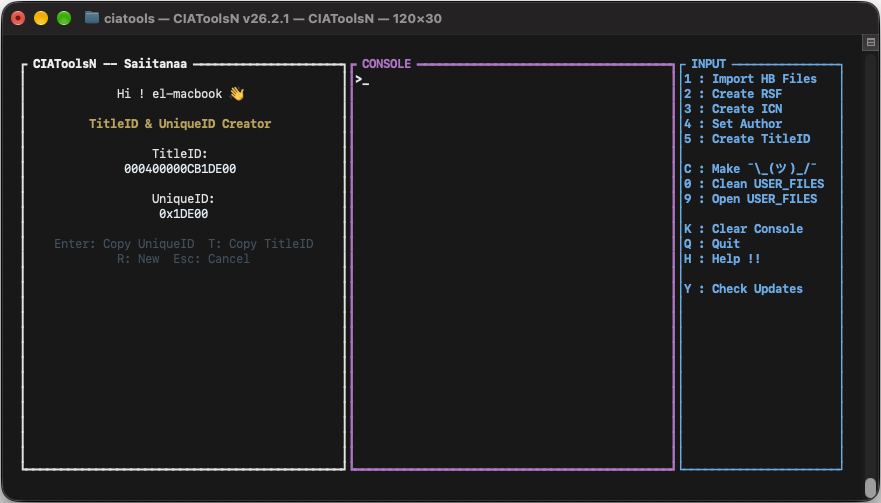
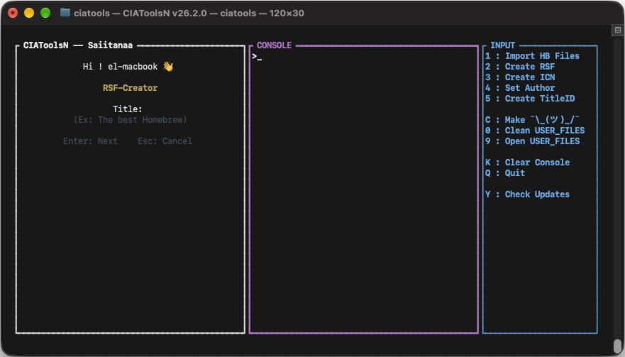
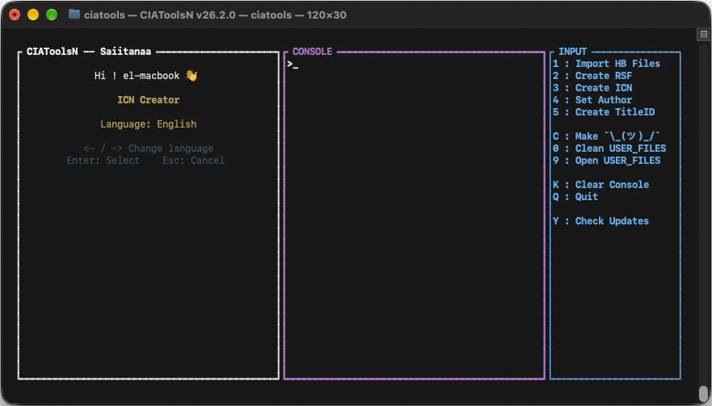
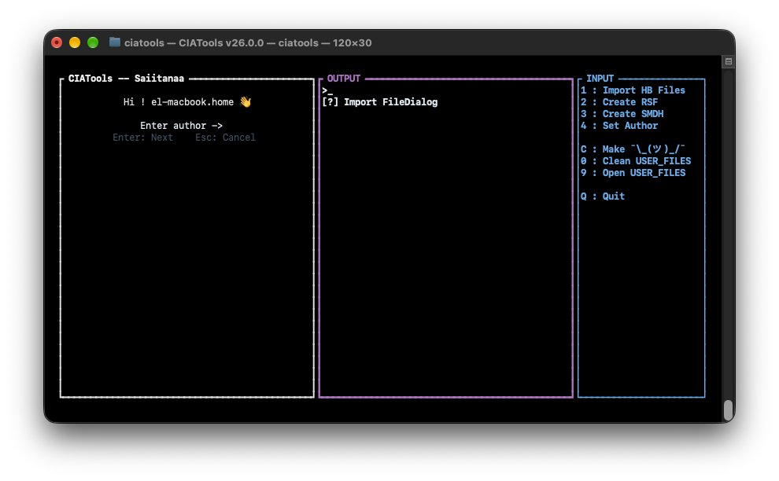
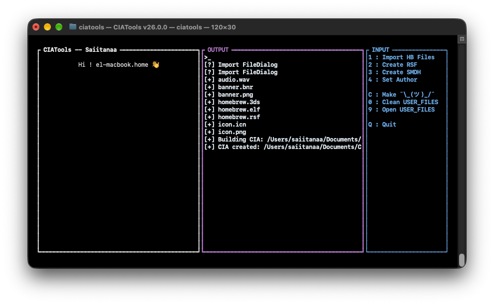

# Usage

**Welcome to the interface!** To get started, **import the files** needed to create your **Homebrew** in `.cia` format.

To do this, **press** `1`. 

**You're now in the file explorer!** Select all the **files** needed for **compilation**.

**Don't have** an TitleID or UniqueID ? No problem ! we'll **create them for you** 😊

To do this, **press** `5` for TitleID Generator or `6` for UniqueID Generator 

#### For TitleID & UniqueID Creator

**Don't have** an `.rsf` or `.smdh` **file**? No problem—we'll **create them for you**!

To do this, **press** `2` for RSF or `3` for SMDH.

#### For RSF File :

#### For ICN File: 

**Perfect! Now let's define an author.** 

To do this, **press** `4`.

**Now we can compile the homebrew!**

To do this, **press** `C`.

